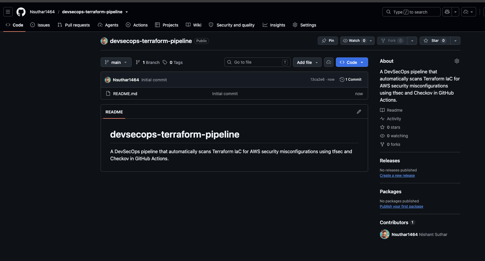
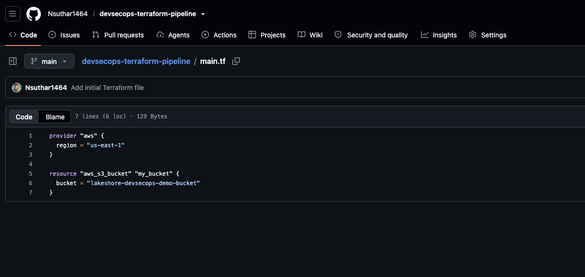
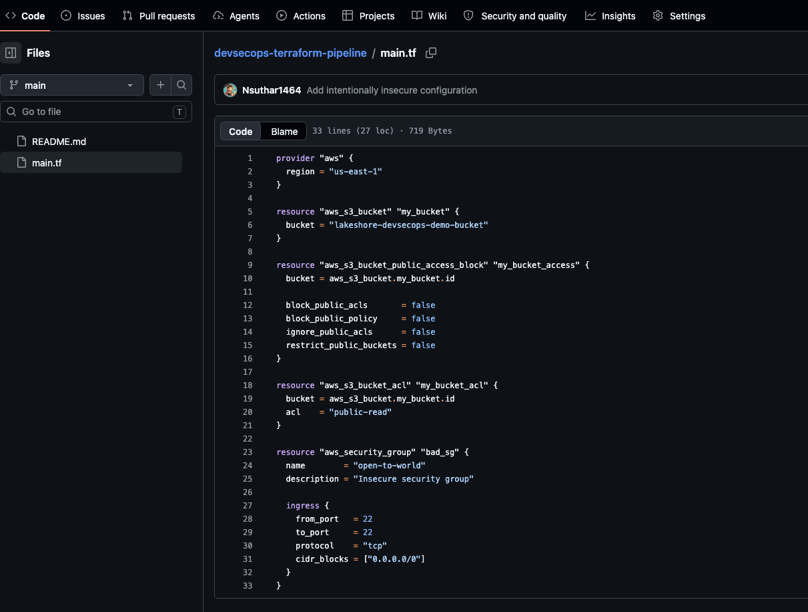
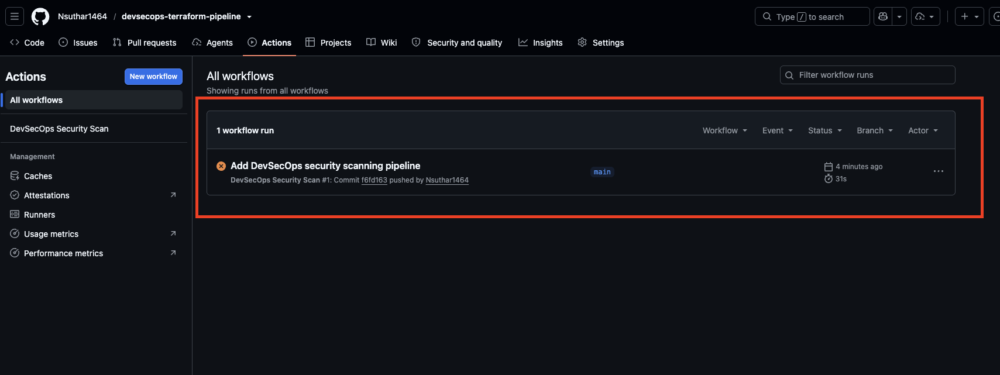
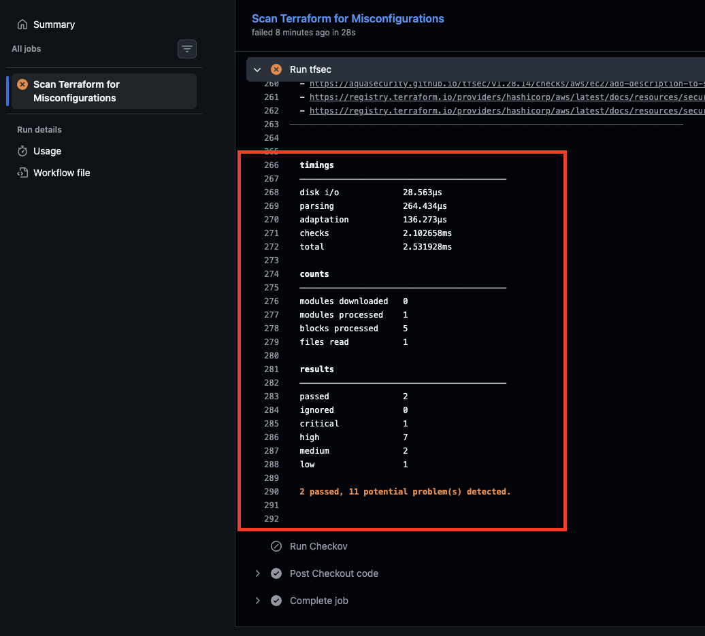
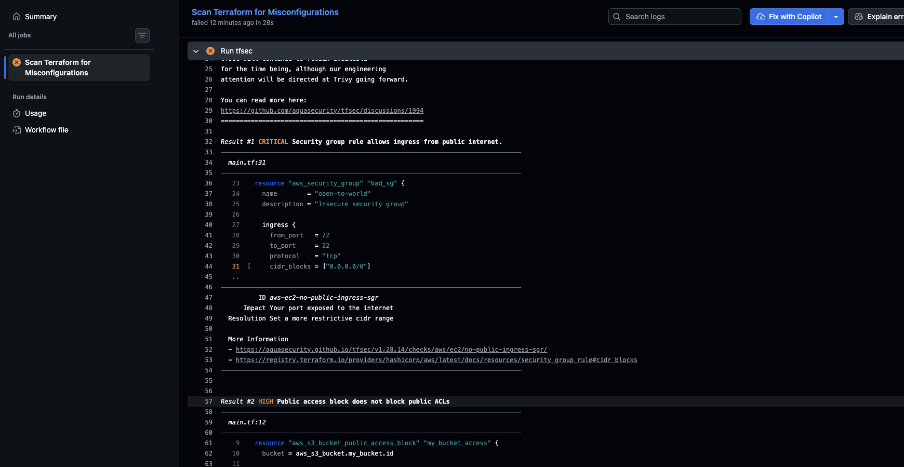
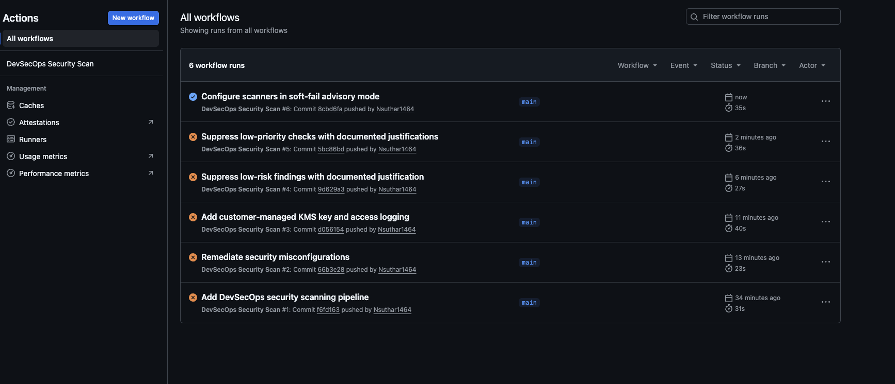

# 🔒 DevSecOps Pipeline: Terraform Security Scanning
### Automated IaC misconfiguration detection with tfsec + Checkov in GitHub Actions

A hands-on DevSecOps project that builds a CI/CD pipeline to automatically scan Terraform Infrastructure-as-Code for AWS security misconfigurations. The pipeline catches insecure cloud configurations before they ever reach production, then demonstrates remediating them and applying real-world security gating.

---

## 📌 Overview

Most cloud breaches start with a misconfiguration: a public storage bucket, an over-permissive firewall rule, unencrypted data. This project shows how to catch those mistakes automatically, in the pipeline, before anything gets deployed.

The workflow:
1. Write Terraform that provisions AWS resources
2. Deliberately introduce realistic security flaws
3. Build a GitHub Actions pipeline that scans the code on every commit using two industry tools (**tfsec** and **Checkov**)
4. Watch the pipeline catch the flaws and fail the build
5. Remediate the infrastructure and configure proper security gating

> ⚠️ **Note:** This project scans Terraform *code* only. No AWS resources are deployed, so it incurs zero cloud cost. The value is in catching issues at the code stage, which is the entire point of DevSecOps ("shift left").

---

## 🎯 What This Project Demonstrates

- Writing Infrastructure-as-Code with **Terraform**
- Building a **CI/CD security pipeline** with GitHub Actions
- Automated **static analysis** of IaC with tfsec and Checkov
- Detecting real AWS misconfigurations (public buckets, open SSH, missing encryption)
- **Remediating** findings with secure configurations (KMS encryption, public access blocks, restricted ingress)
- **Risk-based triage:** suppressing low-priority findings with documented justification, and configuring advisory vs. blocking scan modes

---

## 🛠️ Tools Used

- **Terraform** — Infrastructure-as-Code
- **tfsec** — static analysis scanner for Terraform
- **Checkov** — policy-as-code scanner (Prisma Cloud)
- **GitHub Actions** — CI/CD automation

---

## 🔧 Step 1 — The Infrastructure

The pipeline scans a `main.tf` file that provisions an AWS S3 bucket and a security group.

---

## 💣 Step 2 — Introducing Vulnerabilities

To demonstrate detection, the Terraform was given three realistic, serious misconfigurations:

- **Public S3 bucket** — public access blocks disabled and a `public-read` ACL, making the bucket readable by anyone on the internet (the classic cause of real-world data leaks)
- **No encryption** — data stored unencrypted at rest
- **SSH open to the world** — a security group allowing port 22 from `0.0.0.0/0`, meaning any IP on earth could attempt to connect

---

## 🚨 Step 3 — The Pipeline Catches It

On every push to `main`, the GitHub Actions pipeline runs tfsec and Checkov automatically. Against the insecure code, the scan **failed the build**, exactly as intended.

tfsec reported **11 problems** across severity levels, including a **critical** finding:

The critical finding pinpointed the exact line exposing SSH to the public internet, with the impact and recommended fix:

**The trigger:** the pipeline runs on every `push` to `main`, regardless of whether the code is good or bad. It always scans, then reports pass or fail. That is what makes the security automatic rather than something a human has to remember.

---

## 🛡️ Step 4 — Remediation & Security Gating

The infrastructure was then rewritten securely:

- **Public access blocked** on all buckets (all four block settings set to `true`)
- **Customer-managed KMS encryption** with automatic key rotation
- **Versioning enabled** to protect against accidental or malicious deletion
- **SSH restricted** from `0.0.0.0/0` to an internal network range (`10.0.0.0/16`)
- **Access logging** configured to a dedicated log bucket

This eliminated every **critical** and **high** severity finding.

For the remaining low-priority findings (cross-region replication, event notifications, lifecycle rules), the scanners were configured in **advisory (soft-fail) mode**: they still run and report every finding for visibility, but no longer block the pipeline. This mirrors how real teams separate **blocking** security gates (for critical/high issues) from **advisory** ones (for lower-priority hardening), rather than blindly chasing a green checkmark.

The result: a passing pipeline, with the full commit history showing the remediation journey from red to green.

---

## 🧠 Key Takeaways

- DevSecOps means building security into the pipeline so it runs automatically on every change, not as an afterthought
- Static IaC scanning catches misconfigurations at the code stage, before they ever become live cloud resources ("shift left")
- Real remediation is more than flipping settings: encryption, access controls, and network restrictions all matter
- Not every scanner finding must be fixed to zero; mature security work is risk-based triage, fixing what matters and documenting accepted risks
- Separating blocking gates (critical/high) from advisory ones (low-priority) is how real teams keep pipelines both secure and practical

---

## 🚀 Future Improvements

- Add **secret scanning** (e.g. Gitleaks) to catch hardcoded credentials
- Expand to multi-file, multi-environment Terraform (dev/staging/prod)
- Add a **container image scan** (Trivy) to cover the full build
- Post scan results as automated comments on pull requests
- Integrate results into GitHub's Security tab via SARIF upload
